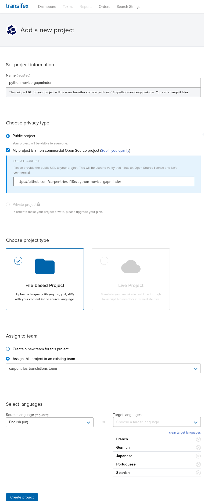

Working with Jekyll lessons
===========================

Prepare the lesson
------------------

To prepare a jekyll-based lesson for translation we need few steps:

#. Fork the repository under :org-repo:``
#. Set-it up to use the Jekyll-theme (i.e., remove everything that's not lesson content).
#. Create it as a submodule within the :org-repo:`i18n` repository.
#. Generate the `po` files using :org-repo:`po4gitbook` software.
#. Since `po4gitbook` generates the whole lesson as a single file, break it into espisodes with ``splitpot.py``.
#. Create the project on Transifex and push the source files.

The first three steps can be done automatically using ``lesson2theme.py`` from
:org-repo:`i18n`. You'll need to `create an access token on GitHub`_

.. code-block:: bash

   $ cd i18n
   i18n (git)-[master]$ export gh_access_token=xxxxxxxx
   i18n (git)-[master]$ python helpers/lesson2theme.py swcarpentry/python-novice-gapminder
   i18n (git)-[python-novice-gapminder]$

That command:

#. forks the repository,
#. fixes any recognised formatting issues that will affect the conversion to PO
   (e.g., :commit-png:`52cacd8`),
#. removes everything that's provided by the theme (e.g., :commit-png:`682a376`),
   and
#. updates ``_config.yml`` so it accepts multiple languages (e.g.,
   :commit-png:`f4e6e3b`).
#. Then adds the forked repo as a submodule to :org-repo:`i18n` repository in a
   branch with the lessons name.

The output of the above command gives you the link of the forked repository so
the result can be checked manually with a list of the following steps that are
to be done manually.

The first of these steps is to run ``po4gitbook`` to update/generate the ``po`` files.

.. warning::

   If the command gets stuck for more than a couple of seconds that's due to
   some formatting issues as the once fixed on the second step above.

.. note::

   The ``update.sh`` goes through all the md files, finds whether there's been
   an update on the sources and propagates to new files, if they've changed
   tries to merge them and marks the blocks as fuzzy if the source has changed.

Now you should have a new file under the ``po`` directory:

.. code-block:: bash

   i18n (git)-[python-novice-gapminder]$ po4gitbook/update.sh
   ...
   i18n (git)-[python-novice-gapminder]$ ls po
   ...
   python-novice-gapminder.pot
   ...

That ``pot`` file is the template that we will use to break it up into chunks
first and then send these to transifex.

.. code-block:: bash

   i18n (git)-[python-novice-gapminder]$ python helpers/splitpot.py po/python-novice-gapminder.pot
   ...
   i18n (git)-[python-novice-gapminder]$ ls transifex/python-novice-gapminder/pot
   00__CODE_OF_CONDUCT.md.pot  06__03-types-conversion.md.pot  12__09-plotting.md.pot           18__15-coffee.md.pot             24__about.md.pot      30__aio.md.pot
   01__CONTRIBUTING.md.pot     07__04-built-in.md.pot          13__10-lunch.md.pot              19__16-writing-functions.md.pot  25__design.md.pot     31__index.md.pot
   ...

Then we need to create the target language directory we want (e.g., ``es`` for
Spanish), and let Transifex's command line tool (``tx``) to prepare the files

.. code-block:: bash

   i18n (git)-[python-novice-gapminder]$ mkdir -p transifex/python-novice-gapminder/es
   i18n (git)-[python-novice-gapminder]$ cd transifex/python-novice-gapminder
   python-novice-gapminder (git)-[python-novice-gapminder]$ cd transifex/python-novice-gapminder
   python-novice-gapminder (git)-[python-novice-gapminder]$ tx config mapping-bulk -p python-novice-gapminder --source-language en --type PO -f '.pot' \
                   --source-file-dir pot --expression "<lang>/{filename}.po" --execute

The last command generates a ``config`` file under a hidden ``.tx`` directory.
We need then to `add the project in Transifex`_ where we need to input a name
(same as the lesson), select that's a public project, add the url of the
project, select that's a file-based project, assign it to the
``carpentries-translation`` team and select the target languages (by default it
adds all that we've used before).

Once the project is created in transifex we can push the project using ``tx``:

.. code-block:: bash

   python-novice-gapminder (git)-[python-novice-gapminder]$  tx push -s --parallel

Once the upload has been completed, you should see the resources available in
the project page in Transifex (e.g., `python-novice-gapminder
<https://www.transifex.com/carpentries-i18n/python-novice-gapminder/dashboard/>`_)

Bring the translations to the rendered page
-------------------------------------------

.. todo::

   add details about how to bring the translated strings.

.. _create an access token on GitHub: https://help.github.com/en/github/authenticating-to-github/creating-a-personal-access-token-for-the-command-line
.. _add the project in Transifex: https://www.transifex.com/carpentries-i18n/add/
